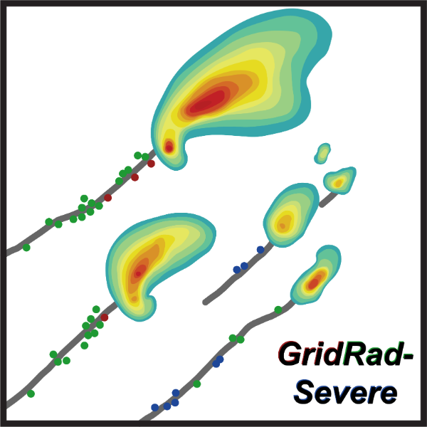

# Investigating the Influence of Topography on Tornadic Events



[](https://github.com/ProjectPythia/cookbook-template/actions/workflows/nightly-build.yaml)
[](https://binder.projectpythia.org/v2/gh/ProjectPythia/cookbook-template/main?labpath=notebooks)
[](https://zenodo.org/badge/latestdoi/475509405)

_See the [Cookbook Contributor's Guide](https://projectpythia.org/cookbook-guide) for step-by-step instructions on how to create your new Cookbook and get it hosted on the [Pythia Cookbook Gallery](https://cookbooks.projectpythia.org)!_

This Project Pythia Cookbook focuses on analyzing a tornadic event using a variety of datasets. A synoptic and mesoscale environment analysis will be done using ERA5 reanalysis and archived operational High Resolution Rapid Refresh (HRRR) forecast output. Analysis of lightning flashes will be provided with GOES 16 Global Lightning Mapper (GLM) lightning flash data. Observed soundings will be plotted and analyze using the `SounderPy` python package. Mosaic Radar and derived products will be analyzed from GridRad grids.

## Motivation

Terrain has long been theorized to play a significant role in improving the local severe convective environment under the proper conditions. This effect has ben noted amongst many of the recent significant tornadic events, including the Turin EF3 of 2023, The Duanesburg EF3 of 2014, the Mechanicville F3 of 1998, and the Great Barington tornado of 1995, though this is far from an exhaustive list. Significant tornadic impacts have occured in the Great Barrington and Mechanicville events, warranting study of such events to improve understanding and predictability. By the end of this cookbood, you should be able to undertake a quality analysis of a multitude of aspects of a significant tornadic event, from synoptic scale to storm scale analysis. 


## Authors

[Alex Kramer](https://github.com/krameral), [Mark Warburg](https://github.com/warburgm), [Amanda Maminimini](https://github.com/Amaminimini), [Alex Colgate](https://github.com/ajcolgat)

### Contributors

<a href="https://github.com/ProjectPythia/cookbook-template/graphs/contributors">
  
</a>

## Structure

This notebook is broken up into the following sections:

1. Introduction and Cases of Terrain Influence
2. Severe Convective Event Analysis
       a) Synoptic analysis from ERA 5 and mesoscale analysis from HRRR
       b) Lightning analysis from GOES 16 GLM
       c) Observed sounding analysis with `SounderPy`
       d) Event progression analysis using GridRad gridded WSR-88D
3. Analysis of select events
       a) 5 May 2018 Deerfield NH EF-2
       b) 29 July 2021 Central New Jersey outbreak


### Section 1 ( Introduction and Cases of Terrain Influence )

In general, when one thinks of tornado outbreaks and significant tornadoes, the Northeast US is typically not the first location that comes to mind. Generally, tornadic events are much more infrequent and less severe than other regions of the continental US, such as the Great Plains and Deep South. Although this is generally true, significant tornadic events and outbreaks can take place over the Northeast. Given the high population density of the Northeast, these events have the potential to inflict great damages to life and property. Some notable significant Northeast tornado events include: The 2023 Tug Hill EF3, the 2014 Duanesburg NY EF3, the 2011 Springfiled tornado family, the 1998 Mechanicville, NY F3, the 1995 Great Barington F4, the 1985 Niles OH-Wheatland PA F5, and the 1979 Windsor Locks, CT F4. Significant impacts to life and property occured with most of these events, especially the Mechanicville, Great Barrington, and Windsor Locks tornadoes.

The Northeast US is composed of significantly more prominent topography as compared to some of the other tornado prone regions, such as the Deep South and Great Plains. Given the prominent topography of the region, many tornadoes that occur in the Northeast are likely to encounter significant changes in topography over the lifespan of the tornado and parent supercell as a whole. Notable studies have demonstrated certain topographic features, such as favorably oriented north-south river valleys, have the ability to locally modify the environment in such a way that favors more intense severe convection. {cite:t}`WASULA:2002` found certain favorable areas of topography were correlated with an increased quantity of severe weather reports. {cite:t}`WASULA:2002` concluded certain terrain features, particularly valleys, have the ability to modify the low level environment, potentially causing a locally backed surface flow or locally more favorable moisture profiles through moisture advection up the valley. Channeling of flow up north-south valleys has been attributed to some of the afformentioned significant tornado examples mentioned above. **Bosart et al. (2006)** theorized locally increased shear in the Hudson and Housatonic Valleys was likely in part responsible for the violent intensity of the Great Barrington F4. **Kramer et al. (2025) and LeBel et al (2021)** both used WRF modeling to confirm the theories of **Bosart et al. (2006)**, with **Kramer et al. (2025)** modeling the 2023 Tug Hill Plateau EF3 and **LeBel et al (2021)** modeling the 1998 Mechanicville F3. Both modeling studies found significant contributions to intensity by the local topography. **Kramer et al. (2025)** found the Black River Valley allowed locally backed low level flow, and thus increased shear in the areas where the greatest damage occured. **LeBel et al (2021)** found the local topography allowed for a locally more unstable environment with locally backed winds in the area where the Mechanicville F3 tornado formed and reached peak intensity. **Tang et al. (2016)** also conclued that the Mohawk Valley was in part responsible for advecting a locally favorable environment into the path of the Duanesburg EF3, as the surrounding environment was not generally conducive for the production of a significant tornado. In addition to local environment modification, terrain can also affect the individual supercells, potentially assisting the tornadogenesis process or intensification of an existing tornado. **Bosart et al. (2006)** theorized the western pariphery of the Catskills may have initiated a pseudo-rear flank downdraft (RFD) surge as the storm descended off the Catskills. **Kramer et al. (2025)** also found evidence of terrain enhancement, as the Tug Hill EF3 reached peak intensity as 

(Add content for this section, e.g., "The foundational content includes ... ")

### Section 2 ( Replace with the title of this section, e.g. "Example workflows" )

(Add content for this section, e.g., "Example workflows include ... ")

## Running the Notebooks

You can either run the notebook using [Binder](https://binder.projectpythia.org/) or on your local machine.

### Running on Binder

The simplest way to interact with a Jupyter Notebook is through
[Binder](https://binder.projectpythia.org/), which enables the execution of a
[Jupyter Book](https://jupyterbook.org) in the cloud. The details of how this works are not
important for now. All you need to know is how to launch a Pythia
Cookbooks chapter via Binder. Simply navigate your mouse to
the top right corner of the book chapter you are viewing and click
on the rocket ship icon, (see figure below), and be sure to select
“launch Binder”. After a moment you should be presented with a
notebook that you can interact with. I.e. you’ll be able to execute
and even change the example programs. You’ll see that the code cells
have no output at first, until you execute them by pressing
{kbd}`Shift`\+{kbd}`Enter`. Complete details on how to interact with
a live Jupyter notebook are described in [Getting Started with
Jupyter](https://foundations.projectpythia.org/foundations/getting-started-jupyter).

Note, not all Cookbook chapters are executable. If you do not see
the rocket ship icon, such as on this page, you are not viewing an
executable book chapter.


### Running on Your Own Machine

If you are interested in running this material locally on your computer, you will need to follow this workflow:

(Replace "cookbook-example" with the title of your cookbooks)

1. Clone the `https://github.com/ProjectPythia/cookbook-example` repository:

   ```bash
    git clone https://github.com/ProjectPythia/cookbook-example.git
   ```

1. Move into the `cookbook-example` directory
   ```bash
   cd cookbook-example
   ```
1. Create and activate your conda environment from the `environment.yml` file
   ```bash
   conda env create -f environment.yml
   conda activate cookbook-example
   ```
1. Move into the `notebooks` directory and start up Jupyterlab
   ```bash
   cd notebooks/
   jupyter lab
   ```
